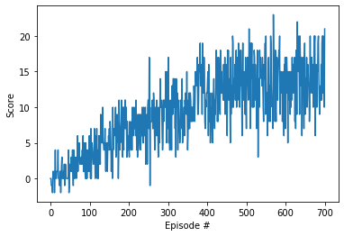

[//]: # (Image References)

[image1]: https://user-images.githubusercontent.com/10624937/42135619-d90f2f28-7d12-11e8-8823-82b970a54d7e.gif "Trained Agent"

# Project 1: Navigation

### Learning Algorithm

For this project, I train an agent with [DQN](https://storage.googleapis.com/deepmind-media/dqn/DQNNaturePaper.pdf) to navigate (and collect bananas!) in a large, square world.  

#### DQN architecture
Input: 			37 dimentional vector
Hidden Layer 1: 	64 nodes
Activate Function: 	Relu
Hidden Layer 2: 	64 nodes
Activate Function: 	Relu
Output: 		4 nodes

#### Hyperparameter

```python
BUFFER_SIZE = int(1e5)  # replay buffer size
BATCH_SIZE = 64         # minibatch size
GAMMA = 0.99            # discount factor
TAU = 1e-3              # for soft update of target parameters
LR = 5e-4               # learning rate 
UPDATE_EVERY = 4        # how often to update the network
```

### Plot of Rewards



### Ideas for Future Work

- Implement a [double DQN](https://arxiv.org/abs/1509.06461), a [dueling DQN](https://arxiv.org/abs/1511.06581), and/or [prioritized experience replay](https://arxiv.org/abs/1511.05952)!
- For an extra challenge after passing this project, try to train an agent from raw pixels! Check out (Optional) Challenge: Learning from Pixels in the classroom for more details.

#### (Optional) Challenge: Learning from Pixels

A more challenging task would be to learn directly from pixels!

To solve this harder task, you'll need to download a new Unity environment.  This environment is almost identical to the project environment, where the only difference is that the state is an 84 x 84 RGB image, corresponding to the agent's first-person view.  (**Note**: Udacity students should not submit a project with this new environment.)

You need only select the environment that matches your operating system:
- Linux: [click here](https://s3-us-west-1.amazonaws.com/udacity-drlnd/P1/Banana/VisualBanana_Linux.zip)
- Mac OSX: [click here](https://s3-us-west-1.amazonaws.com/udacity-drlnd/P1/Banana/VisualBanana.app.zip)
- Windows (32-bit): [click here](https://s3-us-west-1.amazonaws.com/udacity-drlnd/P1/Banana/VisualBanana_Windows_x86.zip)
- Windows (64-bit): [click here](https://s3-us-west-1.amazonaws.com/udacity-drlnd/P1/Banana/VisualBanana_Windows_x86_64.zip)

Then, place the file in the `p1_navigation/` folder in the DRLND GitHub repository, and unzip (or decompress) the file.  Next, open `Navigation_Pixels.ipynb` and follow the instructions to learn how to use the Python API to control the agent.

(_For AWS_) If you'd like to train the agent on AWS, you must follow the instructions to [set up X Server](https://github.com/Unity-Technologies/ml-agents/blob/master/docs/Training-on-Amazon-Web-Service.md), and then download the environment for the **Linux** operating system above.
