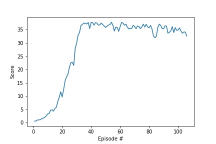
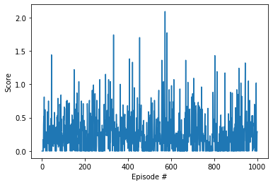
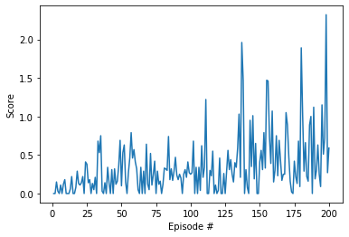
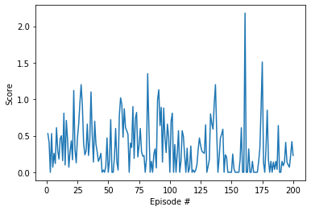

[//]: # (Image References)


# Project 2: Continuous Control

### Learning Algorithm

For this project, I train an agent with [DDPG](https://arxiv.org/abs/1509.02971) to move a double-jointed arm to target locations.  

#### DDPG architecture
Input: 			33 dimentional vector

##### Actor 
Hidden Layer 1: 	400 nodes
Activate Function: 	Relu
Hidden Layer 2: 	300 nodes
Activate Function: 	Relu
Output: 		4 nodes
Activate Function: 	Tanh

##### Critic 
Hidden Layer 1: 	400 nodes(4 action nodes)
Activate Function: 	Relu
Hidden Layer 2: 	300 nodes
Activate Function: 	Relu
Output: 		1 node
Activate Function: 	None

#### Hyperparameter
Methods 1 Solved this project in eposide 
Methods 2 Solved this project in eposide 124

##### Methods 1
```python
BUFFER_SIZE = int(1e5)  # replay buffer size
BATCH_SIZE = 1024         # minibatch size
GAMMA = 0.99            # discount factor
TAU = 1e-3              # for soft update of target parameters
LR_ACTOR = 1e-4         # learning rate of the actor 
LR_CRITIC = 1e-3        # learning rate of the critic
WEIGHT_DECAY = 0        # L2 weight decay
```

##### Methods 2
```python
# 256-128 layer node
BUFFER_SIZE = int(1e6)  # replay buffer size
BATCH_SIZE = 128         # minibatch size
GAMMA = 0.99            # discount factor
TAU = 1e-3              # for soft update of target parameters
LR_ACTOR = 1e-4         # learning rate of the actor 
LR_CRITIC = 1e-4        # learning rate of the critic
WEIGHT_DECAY = 0        # L2 weight decay
```


### Plot of Rewards



#### Failed 
I have tried many methods, but failed.
I save some the failed experience as follows.





### Ideas for Future Work

- Try other hyper parameters, like clipping, batchnorm
- Try other algorithms like [PPO](https://arxiv.org/pdf/1707.06347.pdf), [A3C](https://arxiv.org/pdf/1602.01783.pdf), and [D4PG](https://openreview.net/pdf?id=SyZipzbCb)

### (Optional) Challenge: Crawler Environment

After you have successfully completed the project, you might like to solve the more difficult **Crawler** environment.

![Crawler][image2]

In this continuous control environment, the goal is to teach a creature with four legs to walk forward without falling.  

You can read more about this environment in the ML-Agents GitHub [here](https://github.com/Unity-Technologies/ml-agents/blob/master/docs/Learning-Environment-Examples.md#crawler).  To solve this harder task, you'll need to download a new Unity environment.  (**Note**: Udacity students should not submit a project with this new environment.)

You need only select the environment that matches your operating system:
- Linux: [click here](https://s3-us-west-1.amazonaws.com/udacity-drlnd/P2/Crawler/Crawler_Linux.zip)
- Mac OSX: [click here](https://s3-us-west-1.amazonaws.com/udacity-drlnd/P2/Crawler/Crawler.app.zip)
- Windows (32-bit): [click here](https://s3-us-west-1.amazonaws.com/udacity-drlnd/P2/Crawler/Crawler_Windows_x86.zip)
- Windows (64-bit): [click here](https://s3-us-west-1.amazonaws.com/udacity-drlnd/P2/Crawler/Crawler_Windows_x86_64.zip)

Then, place the file in the `p2_continuous-control/` folder in the DRLND GitHub repository, and unzip (or decompress) the file.  Next, open `Crawler.ipynb` and follow the instructions to learn how to use the Python API to control the agent.

(_For AWS_) If you'd like to train the agent on AWS (and have not [enabled a virtual screen](https://github.com/Unity-Technologies/ml-agents/blob/master/docs/Training-on-Amazon-Web-Service.md)), then please use [this link](https://s3-us-west-1.amazonaws.com/udacity-drlnd/P2/Crawler/Crawler_Linux_NoVis.zip) to obtain the "headless" version of the environment.  You will **not** be able to watch the agent without enabling a virtual screen, but you will be able to train the agent.  (_To watch the agent, you should follow the instructions to [enable a virtual screen](https://github.com/Unity-Technologies/ml-agents/blob/master/docs/Training-on-Amazon-Web-Service.md), and then download the environment for the **Linux** operating system above._)

