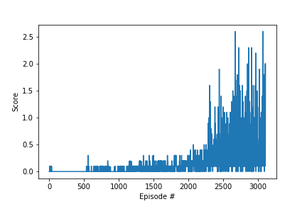

[//]: # (Image References)

[image2]: https://user-images.githubusercontent.com/10624937/42135622-e55fb586-7d12-11e8-8a54-3c31da15a90a.gif "Soccer"


# Project 3: Collaboration and Competition

### Learning Algorithm

For this project, I train an agent with [DDPG](https://arxiv.org/abs/1509.02971) to control rackets to bounce a ball over a net. The DDPG algorithm continuously improves the policy as it explores the environment. It applies gradient descent to the policy with minibatch data sampled from a replay pool and use target networks (like DQN)  for both the critic and the policy network. The DDPG also use the soft update to make the update more smoothly.

Note: the noise is very important for continuous action space.

#### DDPG architecture
Input: 			24 dimentional vector
```python
The state for the first agent looks like: 
[ 0.          0.          0.          0.          0.          0.
  0.          0.          0.          0.          0.          0.
  0.          0.          0.          0.         -6.65278625 -1.5
 -0.          0.          6.83172083  6.         -0.          0.        ]
```

##### Actor 
Hidden Layer 1: 	256 nodes
Activate Function: 	Relu
Hidden Layer 2: 	128 nodes
Activate Function: 	Relu
Output: 		4 nodes
Activate Function: 	Tanh

##### Critic 
Hidden Layer 1: 	256 nodes(2 action nodes)
Activate Function: 	Relu
Hidden Layer 2: 	128 nodes
Activate Function: 	Relu
Output: 		1 node
Activate Function: 	None

#### Hyperparameter
Solved this project in eposide 3109


##### Methods 1
```python
BUFFER_SIZE = int(1e6)  # replay buffer size
BATCH_SIZE = 1024         # minibatch size
GAMMA = 0.99            # discount factor
TAU = 1e-3              # for soft update of target parameters
LR_ACTOR = 1e-4         # learning rate of the actor 
LR_CRITIC = 1e-4        # learning rate of the critic
WEIGHT_DECAY = 0        # L2 weight decay
```

Note: I have solved this project with some other minor different parameters in about eposide 500, I do not save the parameter. I may try it later.

### Plot of Rewards




### Ideas for Future Work

- Try other hyper parameters and hidden nodes, like clipping, batchnorm
- Try adding Prioritized Experience Replay to DDPG
- Try other algorithms like [PPO](https://arxiv.org/pdf/1707.06347.pdf), [A3C](https://arxiv.org/pdf/1602.01783.pdf), and [D4PG](https://openreview.net/pdf?id=SyZipzbCb), alphago Zero

### (Optional) Challenge: Play Soccer Environment

After you have successfully completed the project, you might like to solve the more difficult **Soccer** environment.

![Soccer][image2]

In this environment, the goal is to train a team of agents to play soccer.  

You can read more about this environment in the ML-Agents GitHub [here](https://github.com/Unity-Technologies/ml-agents/blob/master/docs/Learning-Environment-Examples.md#soccer-twos).  To solve this harder task, you'll need to download a new Unity environment.  (**Note**: Udacity students should not submit a project with this new environment.)

You need only select the environment that matches your operating system:
- Linux: [click here](https://s3-us-west-1.amazonaws.com/udacity-drlnd/P3/Soccer/Soccer_Linux.zip)
- Mac OSX: [click here](https://s3-us-west-1.amazonaws.com/udacity-drlnd/P3/Soccer/Soccer.app.zip)
- Windows (32-bit): [click here](https://s3-us-west-1.amazonaws.com/udacity-drlnd/P3/Soccer/Soccer_Windows_x86.zip)
- Windows (64-bit): [click here](https://s3-us-west-1.amazonaws.com/udacity-drlnd/P3/Soccer/Soccer_Windows_x86_64.zip)

Then, place the file in the `p3_collab-compet/` folder in the DRLND GitHub repository, and unzip (or decompress) the file.  Next, open `Soccer.ipynb` and follow the instructions to learn how to use the Python API to control the agent.

(_For AWS_) If you'd like to train the agents on AWS (and have not [enabled a virtual screen](https://github.com/Unity-Technologies/ml-agents/blob/master/docs/Training-on-Amazon-Web-Service.md)), then please use [this link](https://s3-us-west-1.amazonaws.com/udacity-drlnd/P3/Soccer/Soccer_Linux_NoVis.zip) to obtain the "headless" version of the environment.  You will **not** be able to watch the agents without enabling a virtual screen, but you will be able to train the agents.  (_To watch the agents, you should follow the instructions to [enable a virtual screen](https://github.com/Unity-Technologies/ml-agents/blob/master/docs/Training-on-Amazon-Web-Service.md), and then download the environment for the **Linux** operating system above._)

